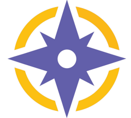

<table>
<thead>
  <tr style="width:40%">
    <td></td>
    <td>COMPASS is a questionnaire developed from MAP personas so that threat modelers can ask specific and targeted questions covering a range of privacy threats. Each question is linked to a persona. Before diving into privacy threats, the following scoping questions might be helpful during a threat modeling session. This is because the existence of personal information must be known, even if it is managed and is not an active threat. Team must ensure that these are properly handled when they exist, and reviews are done for special categories of such information.</td>
  </tr>
</thead>
</table>

| Scoping Questions | 
|---|
| Does the   application code contain personal information?  |
| Do any   databases used by the application contain personal information? If the   application has personal information, has it been de-deidentified?  |
| Do any   application logs contain personal information?   |

The following categories of information often come with special legislative protections.
| Special categories of Personal Information | 
|---|
| **Biometric   data**: Does the application collect biometric data?  |
|  **Children   data**: Does the application collect data from youth   under 16? |
| **CPNI**: Does the application contain CPNI data?  _CPNI or Customer Proprietary Network Information, is the data collected by telecommunications companies about subscribers._  |
|  **Voice and   Video**: Does the application collect voice or video  data? |

<h2> COMPASS Questionnaire </h2>
The threats are categorized by <a href="https://www.fpc.gov/resources/fipps/">FIPPs (Fair Information Practice Principles)</a>, the principles which guide privacy regulation. This makes it easy to understand which threat category a question falls under. 

The categories defined in COMPASS are the following:

1. <a href="COMPASS.md#-accountability-and-auditing-">Accountability and Auditing</a>
2. <a href="COMPASS.md#-data-quality-and-integrity">Data Quality and Integrity</a>
3. <a href="COMPASS.md#use-limitation">Use Limitation</a>
4. <a href="COMPASS.md#data-minimization">Data Minimization</a>
5. <a href="COMPASS.md#transparency">Transparency</a>
6. <a href="COMPASS.md#security">Security</a>
7. <a href="COMPASS.md#purpose-specification">Purpose Specification</a>
8. <a href="COMPASS.md#individual-participation">Individual Participation</a>
9. <a href="COMPASS.md#third-party-sharing">Third-party Sharing</a>

The full questionnaire is available <a href="COMPASS.md"> here</a>. Each question has a persona linked - if you would like to see an example persona for each combination listed here, use <a href="personas.md">this</a> link.
