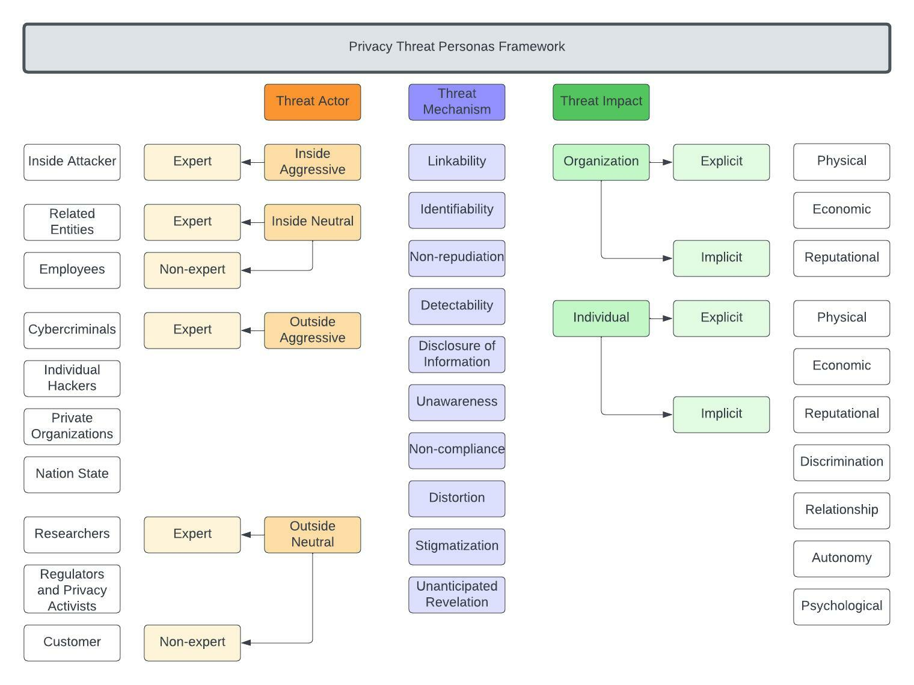

  <h1> Models of Applied Privacy (MAP) </h1> 

Existing privacy threat modeling frameworks rely on partial asset-centric threats, can be time-consuming to implement due to their expansive nature, and need domain-knowledge expertise. We draw from prior literature to create a privacy threat modeling persona framework that developers can use to test and document privacy threats from their overall application. This tool, in addition to privacy impact assessments, can find edge cases of privacy harm. This framework can be used either as a table-top card game for privacy threat modeling. 
<h3> Learn more about privacy threat personas</h3>
The cards for the card game, with instructions, is available here: <a href="personacards/">Persona Cards</a>.
<h3> Take a privacy threat modeling assessment </h3>
<b>Each persona is linked to several practical questions that a threat modeler can ask during sessions with product teams. These questions are not only useful to generate a set of privacy requirements (as early as the product design phase), but also link the requirements with privacy principles. The questionnaire, called xCOMPASS, along with linked personas are available <a href="xCOMPASS/">here</a>.</b> For additional information, please check out the <a href="https://github.com/Comcast/xCompass/edit/main/README.md#-list-of-publications--talks-">list of publications</a> below. 

  <h1> Why do we need personas? </h1> 
As we try to reach privacy maturity, we need to think about high-level, systematic threats to an application that goes beyond privacy compliance. Privacy personas can be a team-exercise to think about overall threats after completing a privacy impact assessment, and before moving into the main threat modeling process. Personas help by contextualizing the threat - since <a href="https://dl.acm.org/doi/fullHtml/10.1145/3544548.3581484">over 80% privacy threats come from non-malicious sources<a>, we need to have a persona-specific approach to identifying threats. 

  <h1> Structure </h1>
  
In terms of structure, the framework has three main components: (i) Threat Actor (characteristics and expertise), (ii) Threat Mechanism, and (iii) Threat Impact. The overall framework structure is shown below. The categories have been developed by combining existing frameworks like <a href="https://www.linddun.org/linddun">LINDDUN</a>, <a href="https://www.nist.gov/privacy-framework/nist-pram">NIST Risk Assessment Methodology<a>, and <a href="https://papers.ssrn.com/sol3/papers.cfm?abstract_id=3782222">Privacy Harm Taxonomy</a>. 

  <h1> Features </h1>
  
**Flexible:** The framework outline makes it easier to add and delete categories as required. For example, if there is a need to add an expert sub-type to a threat actor category, it is easy to create. Similarly, if there are sub-types in threat mechanisms that are not applicable, for example, disclosure of information, since it may be covered under security threat mechanisms, it can be removed with changing the structure of the framework. 

**Scalable:** The components of the framework form a piece-wise architecture. Thus, it is easy for developers to pick a sub-type from each category and create a persona. If a template is created based on each category, a developer can select one item from each category to automatically generate a persona if desired. 

**Customizable:** The framework is independent of industry type and scale. This makes the generated personas easy to customize. For instance, if a developer or a threat modeler selects one item from each of the three component categories, they can customize the resulting persona based on their industry requirements. 

**Moving away from an attacker-only approach:** Literature on security personas have majorly focused on adversarial personas since a majority of security threats originate from attackers. However, there are both malicious and benign threat actors who might cause privacy breaches. This framework addresses both kinds of threat actors across different scenarios. 

  <h1> How to contribute? </h1>
We welcome all kinds of contributions to threat personas, especially:

- Additional personas beyond those already in [xCOMPASS.md](/xCOMPASS/personas.md), using the different combinations from the framework above.
- Specific use cases of MAP (please create a new folder for each use case) in your industry, even if hypothetical.
- Changes to language, typos, fixes, etc.

However, if you have other ideas, albeit simple, please do not hesitate to connect with us. For contribution to xCOMPASS questionnaire, please find more information [here](https://github.com/Comcast/xCompass/edit/main/xCOMPASS/README.md#-how-to-contribute-). Please also have a look at more instructions to commit your contribution in [CONTRIBUTING.md](https://github.com/Comcast/xCompass/blob/main/CONTRIBUTING.md).

<h1> List of Publications & Talks </h1>

Jayati Dev, Bahman Rashidi, Vaibhav Garg. [Models of Applied Privacy (MAP): A Persona Based Approach to Threat Modeling.](https://dl.acm.org/doi/fullHtml/10.1145/3544548.3581484) In Proceedings of the 2023 CHI Conference on Human Factors in Computing Systems (CHI '23).

Rahmadi Trimananda. [The Golden xCOMPASS: The Compass You Need to Navigate through the App-Privacy Universe!](https://www.usenix.org/conference/soups2024/technical-sessions) USENIX SOUPS 2024 Lightning Talks.

Rahmadi Trimananda. [The Golden xCOMPASS: The Compass You Need to Navigate through the App-Privacy Universe!](https://lascon.org/speakers/) OWASP LASCON 2024.

Rahmadi Trimananda. [The Golden xCOMPASS: The Compass You Need to Navigate through the App-Privacy Universe!](https://digitalprivacy.ieee.org/events/digital-privacy-workshop) IEEE Digital Privacy Workshop 2024.

  <h1> License </h1>
   
Licensed under [Apache 2.0](https://github.com/Comcast/MAP/blob/main/LICENSE-Apache-2.0).
