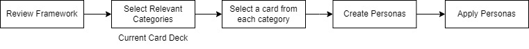
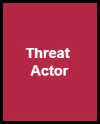
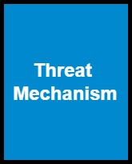
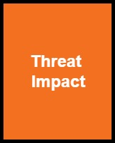

<h1> Persona Creation </h1>

Personas are helpful when thinking about privacy threats to an application as a whole. It provides a bird's eye view of threats - you will not need a data flow diagram at this stage. This is a table-top game to model privacy threats based on the Personas Framework. 

The above figure shows an overview of the steps. 

<h3>Step 1: Review the framework</h3> 
Print out the following set of cards: <a href="Actor.pdf">Threat Actors</a>(red), <a href="Mechanism.pdf">Threat Mechanisms</a>(blue), and <a href="Impact.pdf">Threat Impact</a>(orange), possibly 4-6 cards on a letter-sized page. We have made these low vision and colorblind friendly - if you would like to request additional accessible set of cards, please let us know.  

   

Under threat actor, IA stands for "Inside Aggressive", IN stands for "Inside Neutral", OA stands for "Outside Aggressive", and ON stands for "Outside Neutral". 

Under threat impact, cards that are marked as "Implicit-O" or "Explicit-O" stand for harm to organization, while "Implicit-I" and "Explicit-I" stand for harm to individuals. Each card with have a category and a description. 

<h3>Step 2: Select relevant categories</h3>
Select cards from the three decks that are relevant to your application. For example, if your application does not have any customer or employee data, then probably impact to individuals would be less important.   

If you do not see a card that might be relevant, please submit an issue so that we can update. 

<h3>Step 3: Select a card from each category</h3> 
Personas work as a combination of threat actors, mechanisms, and impact. Make sure to cover all combinations of the three to cover threats. Pick one card from each category, and then mix and match to create additional scenarios. 

<h3>Step 4: Create personas</h3> 
Combine the cards to create a persona embedded in a scenario. 

Here is an example. Let our application be an HR management application. Let us consider <b>Threat Actor:</b> IA - Inside Attacker, <b>Threat Mechanism:</b> Identifiability, and <b>Threat Impact:</b> Implicit-I. Now think of a scenario, "Inside attacker uses identifiable data from application to leak confidential health documents". Try other combinations with the same threat actor, and changing out the mechanisms, and impact. 

<h3>Step 5: Apply personas</h3> 
Make a list of which personas are applicable to your application. You can use the template available <a href="raw_cards/template.pdf">here</a> as well.

  
